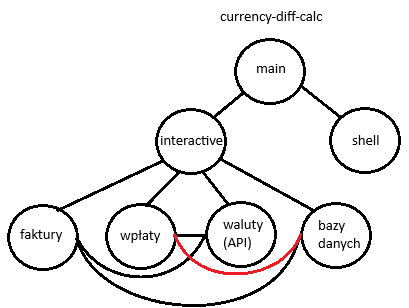

### Autor: Krzysztof Hager 52687 (grupa 2.)
### [Link do repozytorium](https://github.com/Kszyszka/currency-diff-calc) - https://github.com/Kszyszka/currency-diff-calc
# Raport: Zadanie 3 - Program księgowy z obsługą róznic kursowych (***currency-diff-calc***)

## Wprowadzenie

W tym dokumentcie przedstawiam proces tworzenia programu księgowego z obsługą różnic kursowych - zadanie z ćwiczeń 3-4 z Podstaw Programowania w Języku Python.

## Założenia

Założenia programu były następujące:
- Zarządzanie fakturami (tworzenie nowych, sprawdzanie statusów)
- Zarządzanie wpłatami (tworzenie nowych, usuwanie, szukanie zależności z fakturami)
- Różnice kursowe (wyliczanie dowolnych, integracja z wpłatami i fakturami)
- Obsługa lokalnych baz danych (jako zapis do plików) - TinyDB
- Wykluczenie jak najwięcej ilości błędów ludzkich
- Budowa hierarchiczna:

    

## Tworzenie programu

Początkowo, program miał być rozbity na 1-2 moduły. Jednak bardzo szybko przekonałem się, że przy moich założeniach projekt będzie bardzo chaotyczny.

W związku z tym został rozbity na 4 części: faktury, wpłaty, różnice kursowe i bazy danych - przy czym każda z części zyskała własny moduł.

W domyśle, użytkownik działa jedynie na funkcjach dostępnych z modułów wpłaty oraz faktury. Waluty oraz bazy danych nie są zbyt dostępne dla użytkownika, ponieważ dane są walidowane w dwóch pierwszych modułach, a pozostałe pełnią funkcje wspomagające i końcowe (można je uznać za pewnego rodzaju backend, mimo że nim nie jest).

Pomysły dodatkowych funkcjonalności powstawały w trakcie pisania projektu, jednak zdecydowanie największą jego częścią jest poprawne wprowadzanie danych oraz wykluczanie błędu ludzkiego, którego obecność mogłaby rozsypać bazę i tworzyć jeszcze więcej błędów w przyszłości.

## Napotkane problemy

1. Przypisywanie klucza podstawowego fakturom i wpłatom
2. Praca przy pustych bazach danych (próba odwołania się do niczego)
3. Poprawna walidacja wprowadzanych danych oraz API (dużo miejsc na popełnienie różnych błędów)
4. Dodawanie specjalnych atrybutów do klas, które są zależne od innych modułów (np. klucz podstawowy do bazy, kurs z API)
5. Pisanie nieuniwersalnych funkcji, przez co początkowo wymagane było powtarzanie kodu
6. Zachowanie czystości kodu, uniwersalnego sposobu wypisywania danych etc.

## Rozwiązanie problemów

1. Zdobywanie klucza podstawowego poprzez znalezienie ostatniego klucza w bazie i dodania do niego '1'. Po późniejszym rozeznaniu tematu, TinyDB sam przypisuje klucze podstawowe do rekordów, jednak moje rozwiązanie (id jako klucz podstawowy w atrybucie klasy), pozwala na całkiem zręczne wykorzystanie z innymi modułami.

2. Ustawianie pustego rekordu zerowego, wtedy jeśli baza jest pusta, powstaje rekord '0', który po odczytaniu zwróci klucz podstawowy '1'. Reszta działa bez problemu.

3. Zamknięcie walidacji w metodach *is_valid(self)*, która uzależnia dalsze działanie programu i zapisy do baz od wyniku walidacji.

4. Atrybuty są odczytywane z modułów bazy danych oraz walut i zaczytywane z pomocą *setattr()*. Z perspektywy czasu, mogłem dodać do klas po prostu opcjonalny atrybut, który w przypadku nie podania zaczytywałby dane z dodatkowych modułów, a w przypadku podania nie musiałby obciążać reszty programu.

5. Przepisywanie funkcji w sposób pozwalający na ich wykorzystanie w więcej niż jednym miejscu i odwoływanie się do nich w sposób naturalny i czytelny.

6. Przy zachowaniu czystości pomógł mi przede wszystkim pylint. Jednak tak naprawdę kod mógł zostać dopiero oczyszczony po zakończeniu pisania całego programu. Wtedy usunięte zostały rzadko wykorzystane funkcje i metody, w wyniku testów manualnych wszystkie wypisy danych zostały ujednolicone.

## Podsumowanie

Był to zdecydowanie najbardziej zawiły i największy program jaki miałem okazję napisać. Największą rzeczą, jaką udało mi się wyciągnąć z tego doświadczenia, to to, w jaki sposób myśleć oraz pisać, aby kod działał w przyszłości - kiedy projekt będzie się rozrastał. A nie pisać tylko kod, który będzie działał przez chwilę, dla jednego zadania.

## Załączniki
- Menu programu:

    

> Raport przygotowany przez: Krzysztof Hager 52687
> Data: 05.11.2023